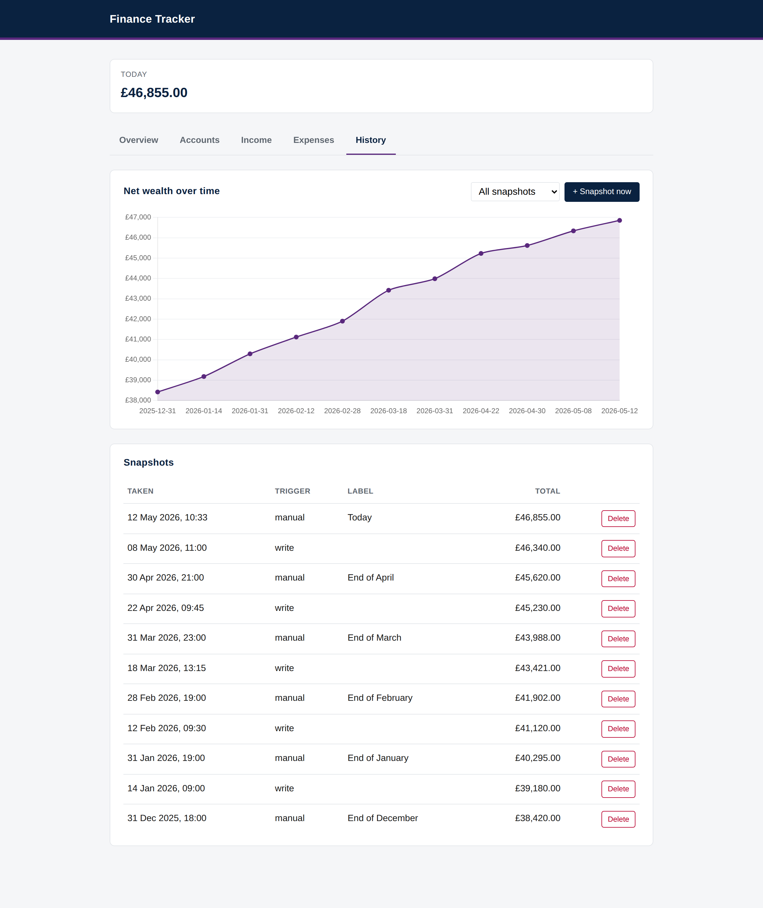
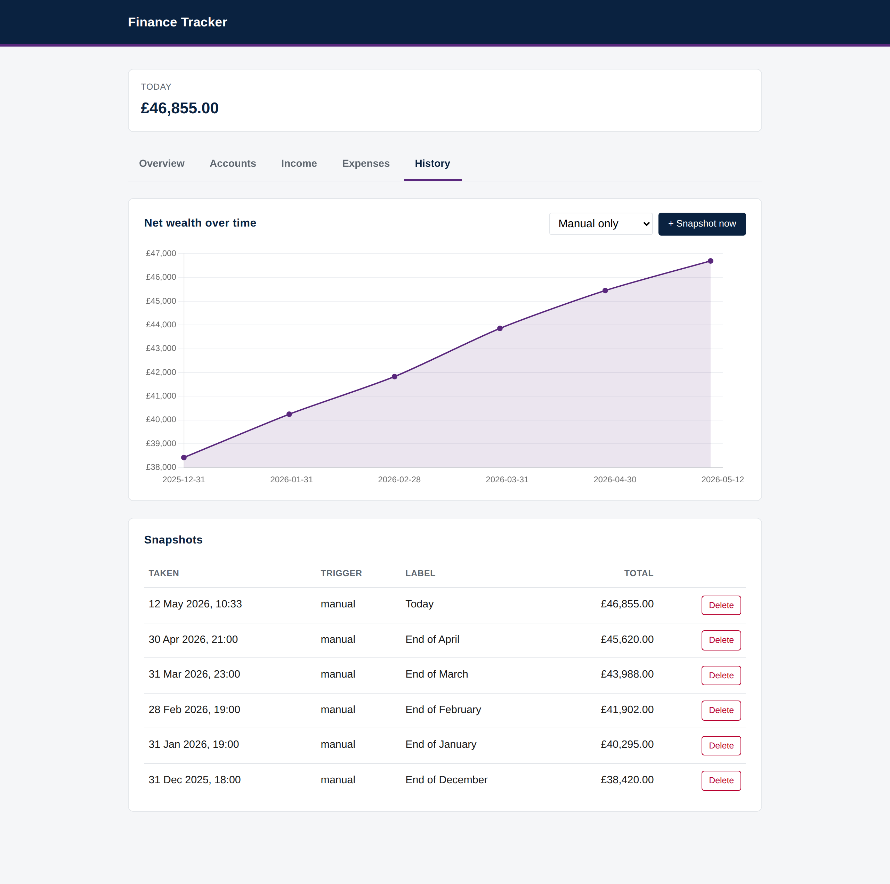

# Finance-Tracker

Personal net wealth dashboard. FastAPI + SQLite. Self-hosted on a Raspberry Pi.




## What it does

The Overview tab shows today's net wealth and a chart projecting balance over the next five years. Headline cards summarise the projection at fixed horizons and at a custom date. A card at the bottom shows the latest Fidelity Index World Fund price with its daily change.

The fund price comes from the [public factsheet](https://www.fidelity.co.uk/factsheet-data/factsheet/GB00BJS8SJ34-fidelity-index-world-fund-p-acc/key-statistics). The server caches it in SQLite and refetches at most once per London day, on the first page load of that day. If Fidelity is unreachable, the card keeps showing the last known price and says the update failed.

The Accounts tab manages savings and credit cards. The Income tab lists each source with its monthly amount. The Expenses tab splits monthly and yearly outgoings. The yearly table also shows each item's monthly equivalent.

The History tab plots net wealth against actual snapshots. Every write to accounts, income, or expenses captures a snapshot, with consecutive writes within 60 seconds debounced into one entry. A "Snapshot now" button takes a labelled manual capture that the debounce never replaces. A filter narrows the view to manual snapshots only, or to month-end snapshots only.



## Run locally

```bash
python -m venv .venv
source .venv/bin/activate
pip install -r requirements.txt
uvicorn app.main:app --reload
```

Open http://localhost:8000.

## Installing on a Pi

Set `PI_HOST` to your Pi's hostname or IP, then:

```bash
ssh "$PI_HOST" '
  sudo apt update && sudo apt install -y python3 python3-venv python3-pip git &&
  git clone git@github.com:EwanStewart/Finance-Tracker.git ~/finance-tracker &&
  python3 -m venv ~/finance-tracker/.venv &&
  ~/finance-tracker/.venv/bin/pip install -r ~/finance-tracker/requirements.txt &&
  mkdir -p ~/finance-tracker/data
'

scp data/finance.db "$PI_HOST":finance-tracker/data/finance.db

ssh "$PI_HOST" '
  sudo cp ~/finance-tracker/deploy/finance-tracker.service /etc/systemd/system/ &&
  sudo systemctl daemon-reload &&
  sudo systemctl enable --now finance-tracker
'
```
