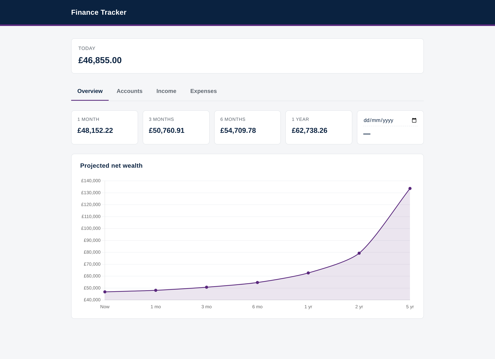
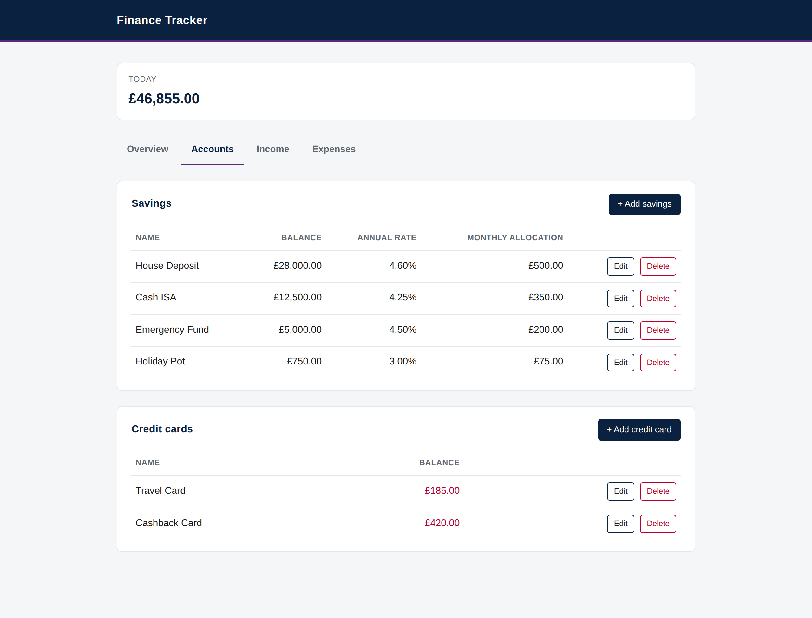
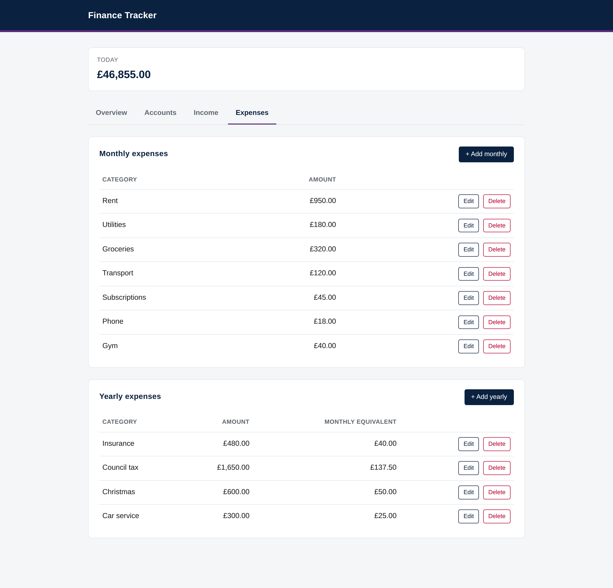

# Finance-Tracker

Finance-Tracker is a self-hosted net wealth dashboard. It runs as a FastAPI service backed by SQLite on a Raspberry Pi Zero 2 W. The UI projects net wealth forward by compounding each savings account at its annual rate while adding its monthly allocation.





## What it does

The Overview tab shows today's net wealth and a chart of projected balance over the next five years. Four fixed horizons display the projected total at 1 month, 3 months, 6 months, and 1 year. A custom date picker projects to any chosen date.

The Accounts tab manages savings and credit cards. Each savings row holds:

- a balance
- an annual rate in basis points
- a monthly allocation

Credit cards store only a balance, shown in red as a debt. Both tables sort to put the largest entries first.

The Income tab lists each source with its monthly amount. The Expenses tab splits monthly and yearly outgoings, with the yearly table showing each item's monthly equivalent alongside.

Money inputs strip out any of these before parsing:

- currency symbols (`£`, `$`, `€`)
- commas
- whitespace

Pasting `£1,234.56` or typing `1234.56` both produce the same value.

## Run locally

```bash
python -m venv .venv
source .venv/bin/activate
pip install -r requirements.txt
uvicorn app.main:app --reload
```

Open http://localhost:8000.

## Test

```bash
pytest
```

If pytest picks up unrelated packages from a sourced ROS environment, clear the relevant variables:

```bash
PYTHONPATH= AMENT_PREFIX_PATH= pytest
```

## Installing on a Pi

Set `PI_HOST` to your Pi's hostname or IP (for example `photobox.local`), then run:

```bash
ssh "$PI_HOST" '
  sudo apt update && sudo apt install -y python3 python3-venv python3-pip git &&
  git clone git@github.com:EwanStewart/Finance-Tracker.git ~/finance-tracker &&
  python3 -m venv ~/finance-tracker/.venv &&
  ~/finance-tracker/.venv/bin/pip install -r ~/finance-tracker/requirements.txt &&
  mkdir -p ~/finance-tracker/data
'

scp data/finance.db "$PI_HOST":finance-tracker/data/finance.db

ssh "$PI_HOST" '
  sudo cp ~/finance-tracker/deploy/finance-tracker.service /etc/systemd/system/ &&
  sudo systemctl daemon-reload &&
  sudo systemctl enable --now finance-tracker
'
```

The service listens on `http://$PI_HOST:8000`.

## Caddy reverse proxy with mDNS aliases

The repo ships a Caddy config that fronts this app alongside another (PhotoVault) on the same host. An mDNS alias service advertises `finance.local` and `photovault.local` so any device on the LAN can reach each app by name. One-off install:

```bash
ssh "$PI_HOST" '
  sudo apt install -y caddy avahi-utils &&
  sudo cp ~/finance-tracker/deploy/Caddyfile /etc/caddy/Caddyfile &&
  sudo cp ~/finance-tracker/deploy/mdns-alias@.service /etc/systemd/system/ &&
  sudo systemctl daemon-reload &&
  sudo systemctl enable --now mdns-alias@finance mdns-alias@photovault &&
  sudo systemctl restart caddy
'
```

After that the dashboard is at http://finance.local.

## Auto-deploy via a self-hosted runner

Every push to `main` triggers `.github/workflows/deploy.yml`, which runs `deploy/update.sh` on the photobox runner. The script:

- fetches origin
- fast-forwards the working tree
- refreshes the venv
- restarts the systemd service

It bails on a dirty working tree.

Register the runner once. Generate a token at Settings > Actions > Runners > New self-hosted runner, then on the Pi:

```bash
ssh "$PI_HOST" '
  mkdir -p ~/runners/finance-tracker && cd ~/runners/finance-tracker &&
  curl -sSL https://github.com/actions/runner/releases/download/v2.334.0/actions-runner-linux-arm64-2.334.0.tar.gz | tar xz &&
  ./config.sh --unattended --replace --disableupdate \
    --url https://github.com/EwanStewart/Finance-Tracker \
    --token <REGISTRATION_TOKEN> \
    --name photobox-finance --labels photobox --work _work &&
  sudo ./svc.sh install ewastewa && sudo ./svc.sh start
'
```
